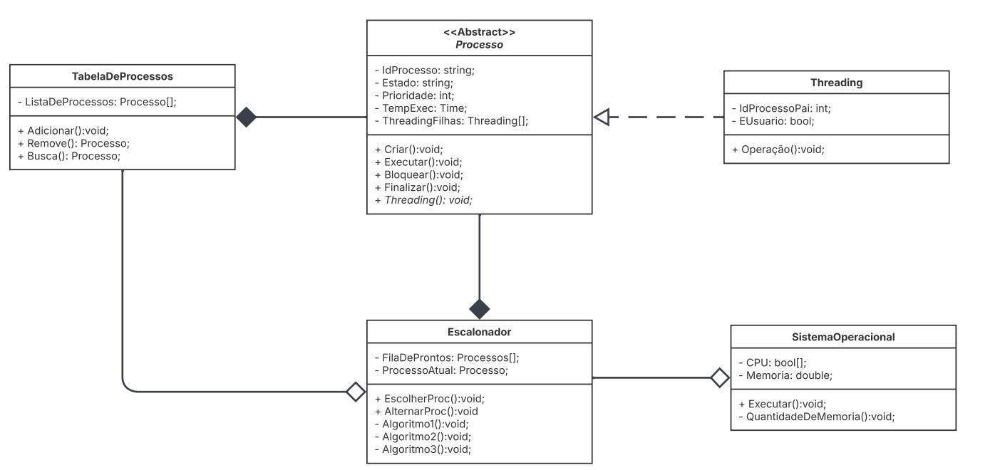

# Simulação de Sistema Operacional

Linguagem a ser utilizada Python

## UML

## 👨‍💻 Autores

- <a href="https://github.com/YanSilva22"> Yan Silva </a>  
- <a href="https://github.com/AlexandreComp456890"> Alexandre Rocha </a>  
- <a href="https://github.com/jhenifersgomes209"> Jhenifer Gomes </a>

