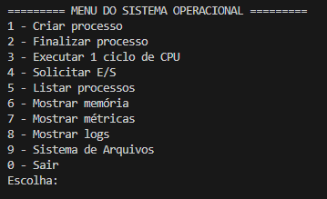
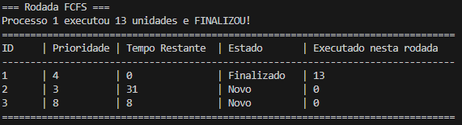
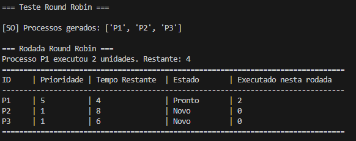
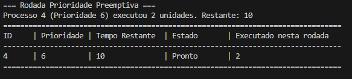
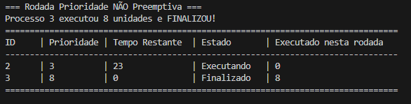
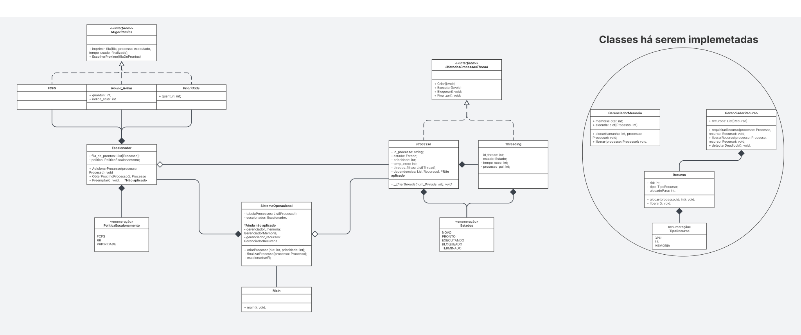

# 🖥️ Simulador de Sistema Operacional

## 📌 Descrição

Este projeto é um **simulador educacional de Sistema Operacional**, desenvolvido em **Python 3**, com o objetivo de demonstrar e visualizar, de forma didática, os conceitos fundamentais da arquitetura e funcionamento de um SO, incluindo:

- **Processos e Threads**
- **Escalonamento de CPU**
- **Gerenciamento de Memória com Paginação**
- **Gerenciamento de Recursos e Detecção de Deadlocks**
- **Gerenciamento de Dispositivos de Entrada/Saída (E/S)**
- **Sistema de Arquivos Hierárquico**

O simulador é executado em **linha de comando (CLI)** e oferece uma interface interativa para criar e gerenciar processos, solicitar operações de E/S, trocar algoritmos de escalonamento e monitorar o estado do sistema em tempo real.

## ✨ Funcionalidades

- **Gerenciamento de Processos (PCB Simulado)**: Criação, finalização e gerenciamento de processos com estados (Novo, Pronto, Executando, Bloqueado, Terminado), prioridades e controle de tempo de execução.
- **Múltiplos Algoritmos de Escalonamento**: Implementação de quatro dos principais algoritmos de escalonamento de CPU:
  - **FCFS (First Come, First Served)**
  - **Round Robin (com quantum configurável)**
  - **Prioridade Preemptiva**
  - **Prioridade Não Preemptiva**
- **Gerenciamento de Memória com Paginação**: Alocação e liberação de memória para processos usando um sistema de paginação simples, com a capacidade de visualizar o mapa de memória.
- **Gerenciamento de Recursos e Deadlock**: Alocação de recursos para processos e um mecanismo de **detecção de deadlock** que verifica a existência de ciclos de espera.
- **Gerenciamento de Dispositivos de E/S**: Simulação de dispositivos de E/S com filas de requisições, permitindo que processos solicitem operações e fiquem bloqueados até sua conclusão.
- **Sistema de Arquivos Hierárquico**: Um sistema de arquivos simulado com suporte a diretórios, arquivos, e comandos como `cd`, `ls`, `mkdir`, `touch`, `write`, `read` e `rm`.
- **Interface Interativa (CLI)**: Um menu interativo para controlar a simulação, permitindo ao usuário executar ciclos de CPU, visualizar processos, logs, métricas de desempenho e interagir com o sistema de arquivos.
- **Métricas de Desempenho**: Coleta e exibição de métricas importantes do sistema, como **taxa de utilização da CPU**, **throughput**, **tempo de retorno** e **tempo de espera** dos processos.
- **Logs do Sistema**: Geração e armazenamento de logs de eventos importantes, como criação de processos, trocas de contexto, operações de E/S e detecção de deadlocks.

## 📂 Estrutura do Projeto

```
ProjectOperationalSystem/
├── Algoritmos/               # Implementações dos algoritmos de escalonamento
│   ├── fcfs.py
│   ├── prioridade.py
│   ├── prioridadeNPreemptivo.py
│   └── round_robin.py
├── Core/
│   ├── DispositivosES/       # Implementação do gerenciador de E/S
│   │   └── dispositivosES.py
│   ├── SistemasArquivo/      # Implementação do sistema de arquivos
│   │   ├── Arquivo.py
│   │   ├── Diretorio.py
│   │   └── SistemasArquivo.py
│   ├── escalonador.py
│   ├── gerenciadorMemoria.py
│   ├── gerenciadorRecursos.py
│   ├── processo.py
│   ├── recurso.py
│   ├── sistemaOperacional.py # Núcleo do SO
│   └── thread.py
├── Documentos/               # Imagens e diagramas do projeto
├── Interface/                # Interfaces e Enumerações
│   ├── IAlgorithmics.py
│   ├── IMetodosProcessosThread.py
│   └── enums.py
├── .gitignore
├── README.md
├── logs_SO.txt
├── main.py                   # Ponto de entrada da aplicação
├── requirements.txt
└── test_DEADLOCK.py          # Testes para detecção de deadlock
```

## 🚀 Como Executar

1.  **Clone o repositório:**

    ```bash
    git clone https://github.com/AlexandreComp456890/ProjectOperationalSystem
    cd ProjectOperationalSystem
    ```

2.  **Execute o programa principal:**

    ```bash
    python main.py
    ```

## 🎮 Execução (`main.py`)

Ao executar o `main.py`, o simulador inicia em modo de **linha de comando**, exibindo um menu interativo com as seguintes opções:



- **Gerenciamento de Processos**: Crie, finalize e liste os processos do sistema.
- **Operações de E/S**: Solicite operações de entrada e saída para um processo, que será bloqueado até a conclusão.
- **Execução e Métricas**: Execute ciclos de CPU, visualize o mapa de memória, métricas de desempenho e logs de eventos.
- **Sistema de Arquivos**: Acesse um sub-menu dedicado para interagir com o sistema de arquivos, com comandos como `mkdir`, `ls`, `cd`, `touch`, `write`, `read` e `rm`.

### Exemplos de Saída

O sistema exibe tabelas formatadas a cada ciclo, mostrando o estado dos processos para cada algoritmo de escalonamento:

| FCFS                                      | Round Robin                                 |
| ----------------------------------------- | ------------------------------------------- |
|  |    |

| Prioridade Preemptiva                     | Prioridade Não Preemptiva                   |
| ----------------------------------------- | ------------------------------------------- |
|  |    |

## UML

A imagem a seguir representa o diagrama UML do projeto:



## 🛠️ Tecnologias Utilizadas

- **Python 3**
- Nenhuma dependência externa

## 👨‍💻 Autores

- <a href="https://github.com/AlexandreComp456890">Alexandre Rocha</a>
- <a href="https://github.com/jhenifersgomes209">Jhenifer Silva</a>
- <a href="https://github.com/YanSilva22">Yan Silva</a>